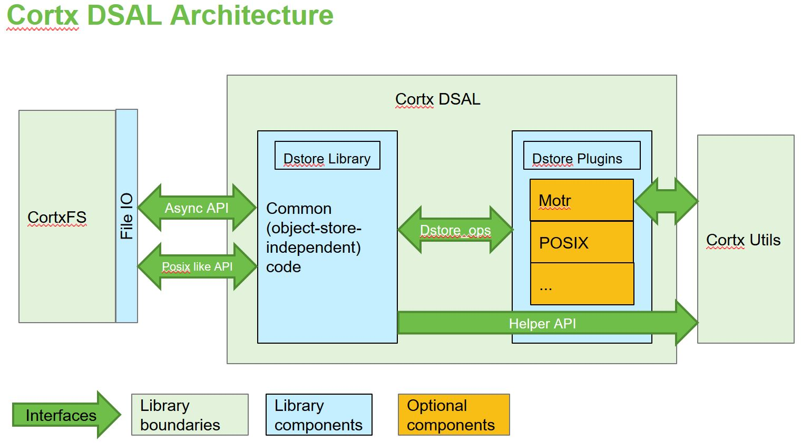

# High Level Overview

Overall DSAL exposes the following functionality
- Initialization/Finalization of Dstore
- Creation/Deletion/Open/Close of dstore object
- I/O operations
- Various utility exposed by dstore backend

## Architectural Overview

## Components

The Data Store Abstraction Layer implemented using following components
- Dstore Plugin
- Dstore Library

### Dstore Plugin

Dstore plugin exposes a set of functionality offered by backend object store. It implements a wraper APIs by using backend object store APIs and exposes it to the Dstore Library of DSAL. During initialization respective backend object store plugin is loaded based on input provided in cofiguration file. Each backend object store will have it's own plugin implemented.

Supported Dstore Plugin by DSAL
- cortx-motr

### Dstore Library

Dstore Library is a backend object store independent implementation which basically provides two different interfaces, which are posix like API interface and Async I/O interface. During I/O request execution dstore library API make use of operation APIs exposed by dstore plugin to achieve specific functionality.  As of now posix like API interface is implemented and Async I/O interface is a future scope.
